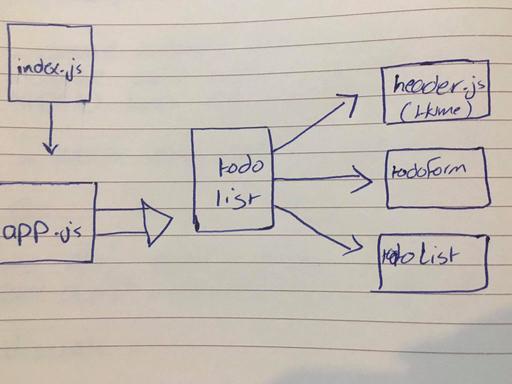

# todo
## LAB - Class 31

## Project: Todo

## Author: Ahlam Alefishat

## Links and Resources

[PR](https://github.com/AhlamAlefishat-401-advanced-javascript/todo/pulls/1)

### PORT - 3000

### How to initialize/run your application (where applicable):

### npm start to start the code.

## UML
